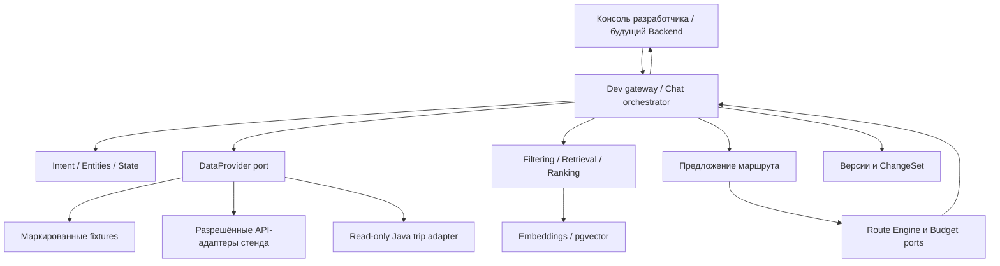

# Архитектура v0.1

Тестовый интерфейс разработчика — минимальный браузерный чат Миши. `start.cmd` поднимает локальный API и открывает страницу; `scripts/dev.py` добавляет `/` только в dev-режиме. Обычный API и Docker не включают UI. Продуктовый frontend и карта остаются задачей коллег.

Уточнение пользователя 2026-10-04: в mrt-ai разрабатываем бота и HTTP API, без продуктового frontend. Фото — концепт поведения. Экраны и карта принадлежат frontend коллег. Тестовый интерфейс — минимальный браузерный чат scripts/developer-chat.html. Возвращаем текст и JSON.

## Разделение ответственности



В production внешним входом предполагается Backend: авторизация, реальные кандидаты, цены, доступность, валидация маршрута, бюджет и сохранение. ML получает нормализованный контекст и возвращает рекомендации/изменения. Dev gateway внутри `mrt-ai` нужен, чтобы разработчик мог пройти пользовательский сценарий независимо от готовности коллег. Он использует те же порты, но не объявляется новым production-бэкендом.

## Фактическая структура локального прототипа

```text
mrt-ai/
  app/                     # API Миши, диалог, trip contracts, Backend adapter, storage
  mrt_ai/
    contracts/catalog.py   # shared domain contracts
    retrieval/
      pipeline.py          # собственная оркестрация стратегий retrieval
      bm25.py              # внутренний lexical baseline
      encoders/sbert.py    # адаптер внешнего SBERT encoder
  models/embeddings/       # локальные некоммитимые pretrained weights
  data/                    # исходные карточки, fixtures, normalized, runtime
  scripts/                 # dev launcher, загрузчик SBERT, evaluator
  schemas/                 # JSON Schema API
  tests/                   # unit, contract и API regression
  docs/                    # продуктовые и ML-спецификации
```

MRT-AI — pipeline/код/контракты, Миша — assistant и API. SBERT — внешний embedding encoder с локальным adapter. Для intent classification используется внешний encoder RuBERT-tiny2 и собственная экспериментальная classification head; данные и метрики принадлежат MRT-AI. Пилот пока уступает rules-v1; локальный developer chat сравнивает классификации параллельно, но помощник не использует classifier для ответа и обновления поездки. Актуальные ограничения и лицензии собраны в [ML_STRUCTURE.md](ML_STRUCTURE.md).

## NLP и модели

Не заменять всю систему одной моделью. Детерминированный слой обрабатывает денежные единицы, даты и арифметику; ML — намерения, семантику и релевантность; планировщик — ограничения. Текст ответа строится по структурированному результату.

Baseline: детерминированные rules-v1 для текущего диалога, BM25 и локальный SBERT для поиска синтетических объектов. SBERT с MIT лицензией бесплатен для локального использования, но не обучался для этого каталога и пока уступает BM25 на крошечном synthetic smoke-наборе. Для intent classification реализован MRT-AI multi-label pilot на 135 synthetic messages с classification head над закреплённым бесплатным RuBERT-tiny2. На 27 синтетических test utterances он уступил rules-v1 (macro F1 0.6266 против 0.7797). Developer chat показывает сравнение на пользовательских репликах, но результат пока не управляет ответом или state update. Для решения о внедрении необходимы реальные вручную размеченные примеры и независимый holdout; encoder сам по себе не является готовым классификатором.

LLM — опциональный сменный адаптер для сложных переформулировок и извлечения JSON. Платный внешний API не требуется базовому MVP. Если включён LLM: schema validation, лимит попыток, отказ от неизвестных object ID и значений вне кандидатов. Ответы поставщиков и тексты объектов — данные, а не инструкции. Арифметика/применение правок не поручаются свободному тексту LLM.

## Получение и ранжирование

1. Нормализовать запрос, слить только известные изменения со state; определить пробелы и противоречия.
2. В DISCOVER отобрать направления из каталога и покрытия провайдеров. Наличие интересного региона не означает наличие билета.
3. Запросить кандидатов с датами, группой и единицами тарифа. Обработать таймауты/квоты без потери диалога.
4. Применить жёсткие фильтры: запреты пользователя, даты, подтверждённая недоступность, неподходящий транспорт/группа. Неизвестная доступность остаётся unknown и исключает статус проверенного полного варианта.
5. Получить семантическую релевантность и признаки сезона, расстояния, интересов, группы, комфорта, стоимости и популярности, если последняя имеет источник.
6. Ранжировать нормализованной взвешенной суммой как baseline. Веса версионировать и подбирать по dev; неизвестные признаки отмечать отдельно, не считать нулевой ценой или рейтингом.
7. Собирать разнообразные наборы, учитывать общий бюджет и реализуемость. Возвращать причины выбора и исключения. Если вариантов нет — объяснить, какое ограничение мешает, не ослаблять его молча.

## Embeddings и данные

Индексировать описания, категории, теги, сезонность и регион объекта; изменчивые цены и наличие не прятать в embeddings. Канонические ID регионов/городов/объектов отдельно от названий и алиасов. «Байкал» и «Кавказ» — туристические направления, не однозначные административные регионы.

Целевая технология из ТЗ — PostgreSQL + pgvector. Она поддерживает векторный поиск в Postgres; см. [официальный проект](https://github.com/pgvector/pgvector). FAISS допускается как изолированный benchmark/локальный адаптер. Не сохранять два несогласованных источника истины.

Манифест индекса: model ID + revision, размерность, нормализация, preprocessing version, checksum корпуса, ordered object IDs, дата. Переиндексация в новую версию, проверка числа/ID/размерности, затем атомарное переключение и возможность отката. Старый `.npy` нельзя применять к изменённому CSV по одному совпадению длины.

CSV-карточки Москвы/области преобразовать в нормализованные записи с источником каждой группы полей и отчётом сомнительных строк. Обобщённое описание региона не превращать в конкретный доступный отель/экскурсию. Координаты и часы работы добавлять из разрешённого источника; фото имеют отдельные права.

## Планирование, бюджет и карта

Планировщик получает матрицу перемещений, координаты, длительности посещений, часовые пояса, часы работы с исключениями по датам, прибытие/отъезд и подтверждённые цены. Предлагает допустимый порядок с эвристикой и локальным улучшением; затем проверяет Route Engine. Закреплённые пользователем объекты нельзя молча заменить.

Учитывать заселение/выселение, число ночей, питание, интервалы отдыха, буферы перед поездом/самолётом и возможные ночные переезды. Среднее время посещения с экспертной оценкой помечать estimate. При отсутствии матрицы маршрут provisional; расстояние по прямой не равно дорожному времени.

Budget port возвращает суммы по категориям и полноту расчёта. Production использует Backend. На стенде отдельный детерминированный калькулятор считает только поставленные тарифы с единицами person/group/night/stay/leg и множителями; не дублирует одну стоимость в отеле и каждом дне. Неизвестные затраты исключают обещание соблюдения полного бюджета. Топливо и платные дороги — только из входных фактов.

Route Engine port возвращает legs и GeoJSON, а UI отображает их. В качестве дорожного адаптера исследовать self-hosted OSRM: [API route/table](https://project-osrm.org/docs/v5.24.0/api/). Это не источник авиарасписаний, стоимости или универсальный мультимодальный движок. Профиль транспорта и покрытие обязаны соответствовать запросу.

Отрисовку карты и выбор тайлов выполняет frontend коллег. Бот предоставляет данные точек и сегментов. Для авиа/жд без фактического трека возвращать schematic, не выдавать дорожную линию за реальный путь.

## Миграция

По прямому решению пользователя от 2026-10-03 полностью переделывать `mrt-ai` на месте. Заменять устаревший `src/` новой структурой без параллельного старого pipeline, legacy-копии и слоя совместимости для `/recommend` и `/extract`. Производные кэши прежней модели не переносить в новую систему. Сохранить исходные карточки регионов, ТЗ и документацию как входные материалы. Новые модули проверять по новой спецификации и тестовым сценариям, не по поведению устаревшего сервиса. Версионирование новых индексов и поездок остаётся необходимым независимо от удаления старой реализации.
